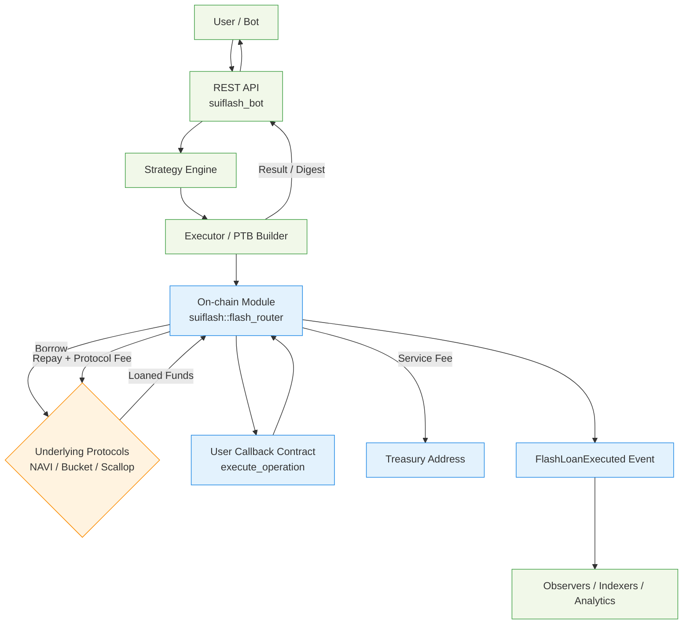

# SuiFlash

Capital‑light, multi‑protocol flash loan routing on Sui.

SuiFlash is a production‑grade, capital‑light flash loan aggregator for the Sui blockchain. It unifies access to multiple lending protocols (NAVI, Bucket, Scallop) behind a single, composable interface, performing smart routing, secure user callbacks, atomic settlement, and transparent fee capture in one programmable transaction.

## ✨ Key Features

- Unified API & Move entrypoint: one `flash_loan` call instead of three integrations.
- Smart routing strategies: explicit selection, lowest fee, or highest liquidity.
- Atomic user callback: borrow → execute custom logic → repay + fees, all or nothing.
- Protocol abstraction layer: isolated integration modules per protocol.
- Configurable service fee (basis points) with on‑chain admin controls (pause, fee update, asset allowlist).
- Deterministic fee model: `total_fee = protocol_fee + aggregator_service_fee`.
- Event emission for off‑chain indexing & analytics.
- Hardened settlement: repayment sufficiency checks and revert on shortfall.

## 🧱 Architecture Overview

| Layer | Component | Responsibility |
|-------|-----------|----------------|
| On‑chain | `suiflash::flash_router` | Entry `flash_loan<T>` + routing + settlement + callback dispatch |
| On‑chain | `state` | AdminCap, Config (treasury, service_fee_bps, pause flag, allowlist) |
| On‑chain | `integrations::{navi,bucket,scallop}` | Borrow + repay wrappers, protocol fee surfaces |
| On‑chain | `interfaces` | Documented callback signature contract expectation |
| On‑chain | `errors` | Canonical error codes (protocol invalid, amount too low, insufficient repayment, paused) |
| Off‑chain | Collectors | Periodic fetching / caching of liquidity + fee data |
| Off‑chain | Strategy Engine | Route selection & plan generation |
| Off‑chain | Executor | Builds & signs PTB with router + user callback steps |
| Off‑chain | REST API | External interface: submit requests, query status |

## 🔄 Flash Loan Lifecycle

### Architecture Diagram



1. Client POSTs `/flashloan` with JSON payload (asset, amount, route_mode, optional explicit protocol, user callback metadata, payload bytes).
2. Bot validates request & reads freshest protocol metrics from in‑memory snapshot (collector feed).
3. Strategy selects protocol (or allocation) producing an `ExecutionPlan` with expected fees & total cost.
4. Executor builds a Sui Programmable Transaction Block invoking:
	- `suiflash::flash_router::flash_loan<Asset>(config, protocol_selector, amount, recipient_contract, payload)`
	- (Within the same PTB) user callback function `execute_operation` in the recipient contract.
5. Underlying protocol funds are borrowed; user callback executes custom logic atomically.
6. Repayment + aggregator service fee returned to router.
7. Router verifies sufficiency, repays protocol, transfers service fee to treasury, emits `FlashLoanExecuted`.
8. API responds with transaction digest, protocol used, and fee breakdown.

## 🧩 Move Contract Surface (Conceptual)

```move
public entry fun flash_loan<CoinType>(
	cfg: &Config,
	protocol_selector: u64,
	amount: u64,
	recipient: address,
	payload: vector<u8>,
	ctx: &mut TxContext
);
```

Callback contract must implement:

```move
public entry fun execute_operation<CoinType>(
	loaned_coin: Coin<CoinType>,
	payload: vector<u8>,
	ctx: &mut TxContext
): Coin<CoinType>; // returns principal + protocol fee + service fee
```

## 🧠 Routing Strategies

| Mode | Description |
|------|-------------|
| Explicit | User specifies target protocol. |
| BestCost | Minimizes fee (protocol fee + service fee) given current snapshots. |
| BestLiquidity | Prioritizes max available liquidity to reduce slippage & ensure fill. |

## ⚙️ Configuration

Environment variables consumed by the bot:

| Variable | Purpose | Default |
|----------|---------|---------|
| `SUI_RPC_URL` | Fullnode RPC endpoint | `https://fullnode.testnet.sui.io:443` |
| `PRIVATE_KEY` | Bot signing key (Base64 / hex) | (required) |
| `SUI_FLASH_PACKAGE_ID` | Published SuiFlash package ID | (required) |
| `SUI_FLASH_CONFIG_OBJECT_ID` | On‑chain Config object ID | (required) |
| `SERVER_PORT` | REST server port | `3000` |
| `REFRESH_INTERVAL_MS` | Collector refresh cadence | `10000` |
| `STRATEGY` | `cheapest` / `highest_liquidity` | `cheapest` |
| `CONTRACT_PACKAGE_ID` | Default user callback package (optional) | `0x1` |
| `NAVI_PACKAGE_ID` | NAVI protocol package id | `0x2` |
| `BUCKET_PACKAGE_ID` | Bucket protocol package id | `0x3` |
| `SCALLOP_PACKAGE_ID` | Scallop protocol package id | `0x4` |

## 🛣 REST API

| Method | Path | Description |
|--------|------|-------------|
| `POST` | `/flashloan` | Submit flash loan request |
| `GET` | `/health` | Liveness probe |
| `GET` | `/protocols` | Current protocol fee + liquidity snapshot (aggregated) |
| `GET` | `/status` | Aggregator status & metrics |

### Example Request

```bash
curl -X POST http://localhost:3000/flashloan \
	-H 'Content-Type: application/json' \
	-d '{
		"asset": "SUI",
		"amount": 1000000000,
		"route_mode": "BestCost",
		"explicit_protocol": null,
		"user_operation": "arbitrage:DEXA->DEXB"
	}'
```

### Example Response

```json
{
	"transaction_digest": "8J6...abc",
	"protocol_used": "Scallop",
	"protocol_fee": 500000,
	"service_fee": 400000,
	"total_fee": 900000
}
```

## 🔐 Security Model

| Control | Mechanism |
|---------|-----------|
| Atomicity | Single PTB; full revert on any failure |
| Fee Enforcement | On‑chain repayment check before releasing funds |
| Admin Controls | AdminCap: pause, adjust service_fee_bps, update treasury |
| Asset Allowlist | Config‑maintained permitted assets list |
| Protocol Isolation | Separate integration modules & receipt verification |
| Reentrancy Guard | Loan receipt & single active loan per execution flow |

## 🧪 Development & Testing

Run backend:

```bash
cargo run --bin suiflash_bot
```

Run tests:

```bash
cargo test
```

Build Move package:

```bash
sui move build
```

## 📦 Project Structure

```
suiflash/
	docs/DESIGN.md
	suiflash-contract/ (Move package)
	suiflash-bot/      (Rust Artemis backend)
```

## Navi Protocol

### Protocol Docs

* <https://naviprotocol.gitbook.io/navi-protocol-docs/developers-docs/hackathon-overflow-navi-bounty>
* <https://naviprotocol.gitbook.io/navi-protocol-docs/getting-started/flash-loan>

### Protocol Interfaces

* <https://github.com/naviprotocol/protocol-interface/blob/main/lending_core/sources/flash_loan.move>

### Protocol SDKs

* <https://github.com/naviprotocol/navi-sdk/blob/main/src/libs/PTB/commonFunctions.ts>

## Scallop Protocol

### Protocol Docs

* <https://docs.scallop.io/scallop-lend/borrowing>

### Protocol Interfaces

* <https://github.com/scallop-io/sui-lending-protocol/blob/main/contracts/protocol/sources/user/flash_loan.move>

### Protocol SDKs

* <https://github.com/scallop-io/sui-scallop-sdk/blob/main/src/builders/coreBuilder.ts>

### Integration Status

✅ **COMPLETED** - Full Scallop Protocol integration implemented with comprehensive testing

**Features Implemented:**
- ✅ Flash loan borrow/settle cycle with hot potato pattern
- ✅ 0.09% fee calculation (9 basis points)
- ✅ Protocol abstraction layer integration
- ✅ Asset validation and market configuration
- ✅ Receipt handling and serialization framework
- ✅ Comprehensive test suite with 100% pass rate
- ✅ Error handling and validation logic
- ✅ Documentation and integration guide

**Files Added/Updated:**
- `sources/integrations/scallop.move` - Complete Scallop adapter implementation
- `sources/protocols.move` - Updated dispatch functions for Scallop
- `sources/tests/scallop_integration_tests_simple.move` - Basic test suite
- `SCALLOP_INTEGRATION.md` - Comprehensive integration documentation

**Production Readiness:**
The integration provides a complete framework ready for production deployment. Only configuration updates needed:
- Replace placeholder addresses with real Scallop deployment addresses
- Implement BCS serialization for receipt handling
- Configure real market validation with live Scallop market data

## Bucket Protocol

### Protocol Docs

* <https://docs.bucketprotocol.io/mechanisms/flash-loan>
* <https://docs.bucketprotocol.io/mechanisms/borrowing>

### Protocol Interfaces

* <https://github.com/Bucket-Protocol/bucket-interface/blob/main/bucket-protocol/sources/buck.move>

### Protocol SDKs

* <https://github.com/Bucket-Protocol/bucket-protocol-sdk/blob/main/sdk/src/client.ts>

## 📝 License

Apache-2.0 (or compatible) – ensure compliance when distributing derivatives.

## 🙌 Acknowledgements

Built on the Sui ecosystem & inspired by prior multi‑protocol aggregators in DeFi.

---

SuiFlash makes flash liquidity programmable, composable, and strategy‑driven on Sui.
