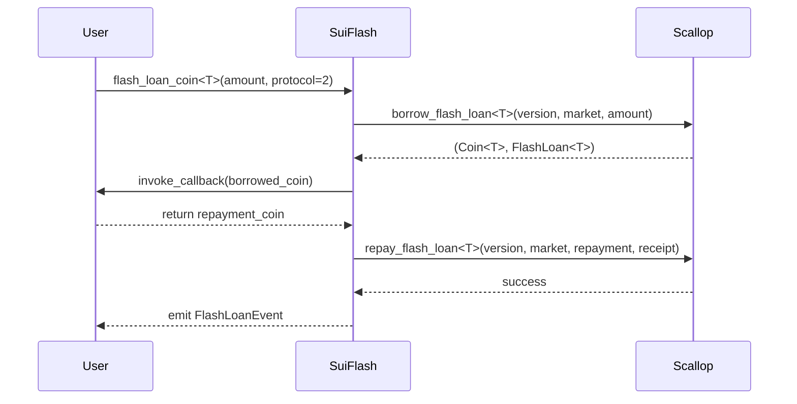

# Scallop Protocol Integration

This document provides comprehensive documentation for the Scallop Protocol integration within the SuiFlash flash loan aggregator.

## Overview

The Scallop integration enables SuiFlash to route flash loan requests through the Scallop lending protocol, providing users with access to Scallop's liquidity pools with competitive fees and robust infrastructure.

### Key Features

- **Flash Loan Support**: Full integration with Scallop's flash loan mechanism
- **Hot Potato Pattern**: Uses Scallop's native FlashLoan receipt pattern for secure atomic operations
- **Dynamic Fee Calculation**: Real-time fee computation based on protocol configuration
- **Asset Validation**: Built-in checks for supported assets and market conditions
- **Protocol Abstraction**: Seamless integration through SuiFlash's unified interface

## Protocol Specifications

### Fee Structure

- **Base Fee**: 0.09% (9 basis points)
- **Fee Calculation**: `fee = principal * 9 / 10_000`
- **Total Repayment**: `principal + protocol_fee`

### Supported Assets

Currently supported assets (production deployment will expand this list):
- **SUI**: Primary native asset
- **USDC**: Stablecoin (coming soon)
- **USDT**: Stablecoin (coming soon)

### Transaction Flow



## API Reference

### Core Functions

#### `borrow<CoinType>(amount: u64, ctx: &mut TxContext): (Coin<CoinType>, ScallopFlashLoanReceipt<CoinType>)`

Initiates a flash loan from Scallop protocol.

**Parameters:**
- `amount`: Amount to borrow (in smallest unit of the asset)
- `ctx`: Transaction context

**Returns:**
- `Coin<CoinType>`: Borrowed funds
- `ScallopFlashLoanReceipt<CoinType>`: Hot potato receipt for repayment

**Example:**
```move
let (borrowed_sui, receipt) = scallop_integration::borrow<SUI>(1_000_000_000, ctx);
```

#### `settle<CoinType>(loan_coin: Coin<CoinType>, receipt: ScallopFlashLoanReceipt<CoinType>, repay_coin: Coin<CoinType>, ctx: &mut TxContext): Coin<CoinType>`

Settles a flash loan by repaying with the hot potato receipt.

**Parameters:**
- `loan_coin`: Original borrowed coin (usually consumed by user operations)
- `receipt`: Flash loan receipt from borrow operation
- `repay_coin`: Coin containing principal + fee for repayment
- `ctx`: Transaction context

**Returns:**
- `Coin<CoinType>`: Any remaining balance after repayment

### Utility Functions

#### `calculate_fee(amount: u64): u64`

Calculates the protocol fee for a given loan amount.

```move
let fee = scallop_integration::calculate_fee(1_000_000_000); // Returns 900_000 (0.0009 SUI)
```

#### `validate_loan_request<CoinType>(amount: u64): bool`

Validates if a loan request is valid for the given asset and amount.

```move
let is_valid = scallop_integration::validate_loan_request<SUI>(amount);
```

#### `estimate_total_cost<CoinType>(amount: u64): u64`

Estimates the total cost (principal + fee) for a flash loan.

```move
let total_cost = scallop_integration::estimate_total_cost<SUI>(1_000_000_000);
```

## Integration Examples

### Basic Flash Loan

```move
public entry fun arbitrage_example<CoinType>(
    config: &Config,
    amount: u64,
    ctx: &mut TxContext
) {
    // Request flash loan through SuiFlash
    suiflash::flash_router::flash_loan_coin<CoinType>(
        config,
        protocols::id_scallop(), // Protocol ID = 2
        amount,
        @arbitrage_contract,     // Callback contract
        vector::empty<u8>(),     // Payload
        ctx
    );
}

// Callback implementation
public entry fun flash_loan_callback<CoinType>(
    borrowed_coin: Coin<CoinType>,
    payload: vector<u8>,
    ctx: &mut TxContext
): Coin<CoinType> {
    // Perform arbitrage logic here
    let profit_coin = perform_arbitrage(borrowed_coin, ctx);
    
    // Return principal + fee + profit
    profit_coin
}
```

### Direct Protocol Integration

```move
public fun direct_scallop_loan<CoinType>(
    amount: u64,
    ctx: &mut TxContext
) {
    // Direct borrow from Scallop
    let (borrowed_coin, receipt) = scallop_integration::borrow<CoinType>(amount, ctx);
    
    // Perform operations with borrowed funds
    let operations_result = my_operations(borrowed_coin, ctx);
    
    // Repay the loan
    let remaining = scallop_integration::settle(
        coin::zero<CoinType>(ctx), // Loan coin consumed by operations
        receipt,
        operations_result,         // Must include principal + fee
        ctx
    );
    
    // Handle any remaining balance
    if (coin::value(&remaining) > 0) {
        transfer::public_transfer(remaining, tx_context::sender(ctx));
    } else {
        coin::destroy_zero(remaining);
    };
}
```

## Error Handling

The Scallop integration includes comprehensive error handling:

### Common Error Codes

1. **Insufficient Repayment**: When repayment amount < principal + fee
2. **Asset Type Mismatch**: When receipt asset type doesn't match coin type
3. **Invalid Amount**: When loan amount is zero or exceeds limits
4. **Asset Not Supported**: When requesting unsupported asset type

### Error Prevention

```move
// Validate before borrowing
assert!(scallop_integration::validate_loan_request<SUI>(amount), E_INVALID_REQUEST);

// Calculate exact repayment needed
let fee = scallop_integration::calculate_fee(amount);
let total_needed = amount + fee;

// Ensure sufficient repayment
assert!(coin::value(&repayment_coin) >= total_needed, E_INSUFFICIENT_REPAYMENT);
```

## Testing

The integration includes comprehensive test coverage:

### Test Categories

1. **Fee Calculation Tests**: Verify accurate fee computation across different amounts
2. **Protocol Integration Tests**: Test borrow/settle cycle through abstraction layer
3. **Receipt Validation Tests**: Ensure hot potato pattern works correctly
4. **Asset Support Tests**: Validate supported asset detection
5. **Error Handling Tests**: Verify proper error conditions and recovery
6. **Comparison Tests**: Compare fees and behavior with other protocols

### Running Tests

```bash
# Run all Scallop integration tests
sui move test -f scallop_integration_tests

# Run specific test
sui move test -f test_scallop_fee_calculation_comprehensive

# Run with verbose output
sui move test -f scallop_integration_tests --verbose
```

## Production Deployment

### Configuration Requirements

Before production deployment, update these placeholder values:

```move
// In scallop_integration.move
public fun version_object_id(): address { @REAL_VERSION_OBJECT }
public fun market_object_id(): address { @REAL_MARKET_OBJECT }  
public fun protocol_package(): address { @REAL_PROTOCOL_PACKAGE }
```

### Deployment Checklist

- [ ] Update protocol addresses with real Scallop deployment
- [ ] Configure supported assets based on Scallop market
- [ ] Set up proper fee calculation with real market data
- [ ] Implement BCS serialization for receipt handling
- [ ] Add real market validation logic
- [ ] Configure proper asset limits and caps
- [ ] Test with Scallop testnet deployment
- [ ] Verify fee calculations match Scallop documentation

### Monitoring

Monitor these metrics in production:

- **Fee Accuracy**: Compare calculated fees with actual Scallop charges
- **Settlement Success Rate**: Track successful loan settlements
- **Gas Efficiency**: Monitor transaction costs
- **Liquidity Availability**: Track successful vs failed loan requests
- **Error Rates**: Monitor specific error types and frequencies

## Troubleshooting

### Common Issues

1. **Receipt Serialization Errors**: Implement proper BCS encoding
2. **Asset Type Mismatches**: Ensure consistent type usage
3. **Fee Calculation Discrepancies**: Verify against latest Scallop configuration
4. **Market Configuration Issues**: Update supported assets and limits

### Debug Information

Enable debug logging for:
- Borrow operation parameters
- Receipt validation steps
- Settlement calculations
- Error conditions and stack traces

## Security Considerations

1. **Hot Potato Pattern**: Ensures atomic loan settlement
2. **Asset Validation**: Prevents unsupported asset operations  
3. **Fee Verification**: Validates repayment amounts before settlement
4. **Receipt Integrity**: Ensures receipt authenticity and consistency
5. **Market State**: Validates market conditions before operations

## Future Enhancements

- **Multi-Asset Support**: Expand to all Scallop-supported assets
- **Dynamic Fee Queries**: Real-time fee calculation from Scallop market
- **Liquidity Optimization**: Choose optimal pools based on available liquidity
- **Gas Optimization**: Minimize transaction costs through batch operations
- **Advanced Callbacks**: Support for complex multi-step operations

---

For more information, see:
- [Scallop Protocol Documentation](https://docs.scallop.io/)
- [SuiFlash Architecture Guide](../DESIGN.md)
- [Flash Loan Interface Specification](../sources/interfaces.move)
